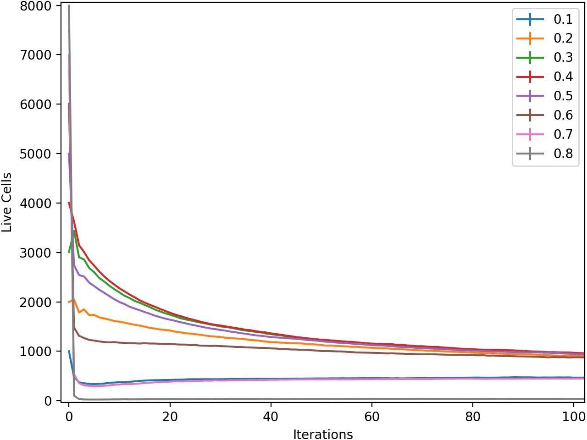

# Conways Game of Life

## Background

From the
[Wikipedia](https://en.wikipedia.org/wiki/Conway's_Game_of_Life) page:

> The Game of Life, also known simply as Life, is a cellular automaton
> devised by the British mathematician John Horton Conway in 1970.
>
> The game is a zero-player game, meaning that its evolution is
> determined by its initial state, requiring no further input. One
> interacts with the Game of Life by creating an initial configuration
> and observing how it evolves.

In this implementation, the initial state is decided randomly, by
providing a probability that any given cell will be alive.

## Code

I started this project because I wanted to learn the basics of Rust. All
the Rust code is included in a single file `src/main.rs`. All of the
logic pertaining to the game is contained in the implementation of the
`Board` structure.

Included in `main.rs` is the `visualise_sim` function which updates once
per second and prints the cells to the terminal, representing live cells
as hashtags and dead cells as empty space. This does not run by default
however, instead the game is run as quickly as possible for 2000
iterations with varying starting fractions of living cells and the total
number of living cells at after each iteration is recorded. For each
starting fraction, the simulation is repeated 100 times to calculate an
average and ascertain the distribution of results. The raw data
generated by these simulations is written to file in csv format as
`out/sim_results.dat`.

`out/analysis.py` reads in the simulation data, calculates the average
and standard deviation after each iteration and plots the evolution of
the board for each starting fraction of live cells.

## Results

The main result for me was successfully building this project in Rust,
with a goal of learning the language. However I couldn't help thinking
a little about the results of the simulation.

The above image shows the first 100 iterations of the simulation. It can
be seen that for higher starting fractions, the population drops greatly
after the first iteration. For 8/10, this drop totally kills off the
population while for 7/10, 6/10 and 5/10 the remaining population is
great enough to continue for future iterations. For starting fractions
below 5/10, the effects of overpopulation have a greatly reduced impact
between the zeroth and first iteration.

Aside from the starting fraction of 8/10 whose population rapidly falls
away to zero, two clear groups emerge converging on seperate values. The
members of these groups seem to depend on the population after the first
iteration. However, as seen below, over a large number of iterations
these two groups converge.

## Future Work

* Improve code structure and readability
  * use macros to tidy up `vailidate_index` function
  * seperate Board, simulation and visualisation functions
* Write more comprehensive tests and add benchmarks
* Introduce multithreading to improve speed of simulations
* More analysis on results
  * Explore what happens for starting fractions between 1/10 and 2/10
  * Using visualisation function, try to identify a difference in
behaviour between the two groups of starting fractions previously
identified
