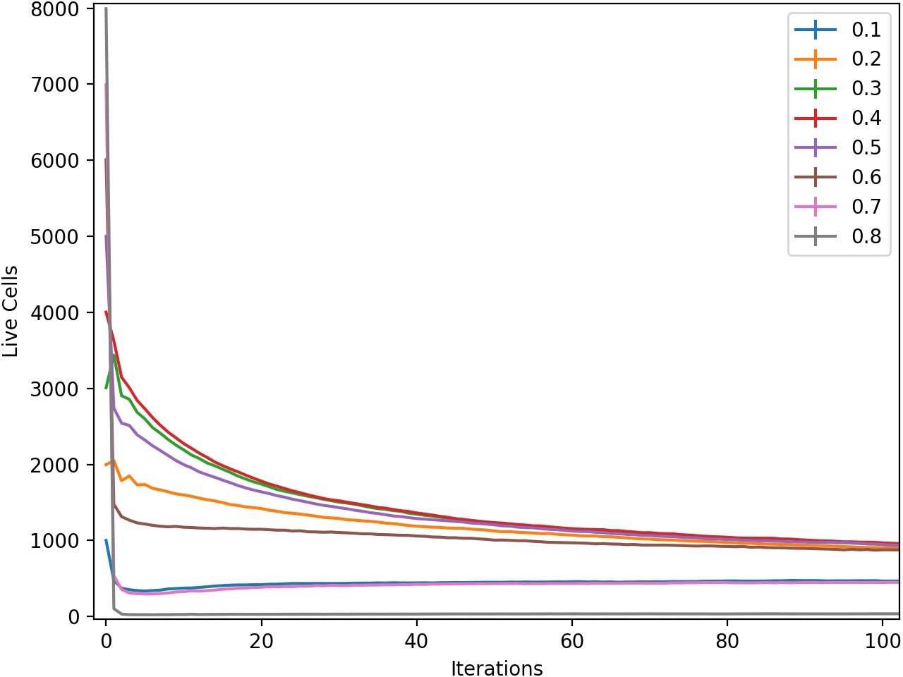
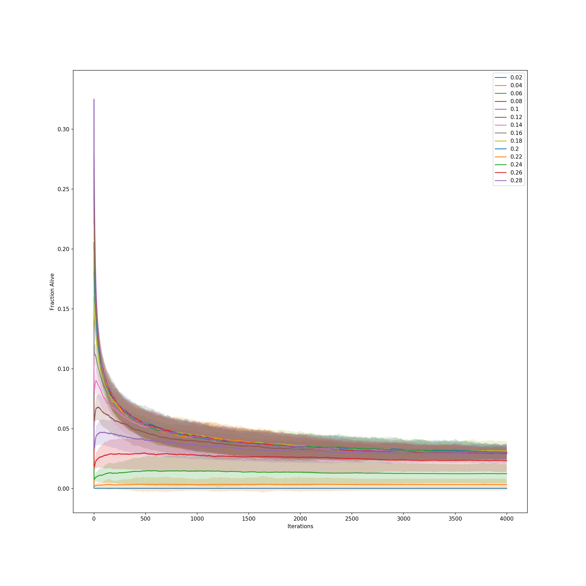

## Results

The main result for me was successfully building this project in Rust,
with a goal of learning the language. However I couldn't help thinking
a little about the results of the simulation.

The above image shows the first 100 iterations of the simulation. It can
be seen that for higher starting fractions, the population drops greatly
after the first iteration. For 8/10, this drop totally kills off the
population while for 7/10, 6/10 and 5/10 the remaining population is
great enough to continue for future iterations.

For starting fractions below 5/10, the effects of overpopulation have a
greatly reduced impact between the zeroth and first iteration. This can
be explained by considering how the average number of neighbours depends
on starting fraction. When half the cells are alive (5/10), the average
cell will have 4 living neighbours causing it to die, whereas at a
starting fraction of 4/10, the average cell will have only 3.2 living
neighbours.

Aside from the starting fraction of 8/10 whose population rapidly falls
away to zero, two clear groups emerge converging on seperate values. The
members of these groups seem to depend on the population after the first
iteration. However, as seen below, over a large number of iterations
these two groups converge.

